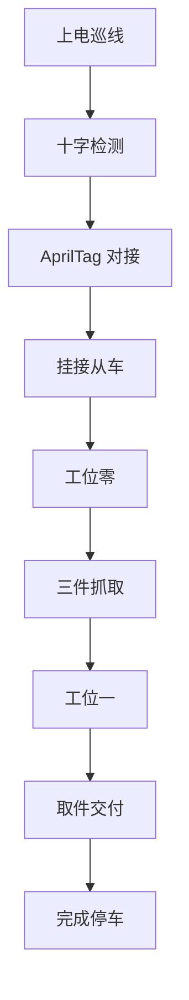

# STM32F407 AGV 智能搬运机器人

> 2026 全国大学生嵌入式芯片与系统设计竞赛 ST 赛道参赛作品

本项目以 STM32F407ZGTx 为主控，构建四轮差速移动底盘、4-DOF 机械臂、独立挂钩舵机与 OpenMV H7 Plus 视觉系统。它将巡线、二维码触发、端侧视觉识别、颜色对准抓取、AprilTag 视觉伺服和无动力从车拖挂串成一套自主搬运流程。

完整任务链路为：巡线行驶 -> 十字路口触发 -> AprilTag 对接从车 -> QR 触发工位任务 -> 视觉识别与抓取 -> 从车装载或交付。

> 当前默认烧录配置用于工位演示：程序假定从车已预先挂接，并从巡线和工位任务开始执行。完整自动对接功能保留在工程中，需恢复经过实车标定的完整构建配置后再启用。

## 目录

- [功能概览](#功能概览)
- [完整作业流程](#完整作业流程)
- [硬件与软件架构](#硬件与软件架构)
- [视觉任务](#视觉任务)
- [构建与部署](#构建与部署)
- [串口调试](#串口调试)
- [目录结构](#目录结构)
- [安全说明](#安全说明)

## 功能概览

| 能力 | 已实现内容 |
| --- | --- |
| 自主巡线 | 5 路红外巡线、PID 转向、十字路口识别与路线切换 |
| 从车对接 | AprilTag 搜索、视觉伺服倒车、挂钩动作与回归巡线 |
| 视觉搬运 | QR 任务触发、AI 分类、颜色目标对准、抓取与放置 |
| 机械臂控制 | 4-DOF 机械臂动作组、独立挂钩舵机、五次样条平滑运动 |
| 实时控制 | TIM6 100 Hz 控制心跳，巡线、视觉伺服和机械臂状态协同运行 |
| 调试与调参 | UART5 指令调试、OpenMV 数据查看、可选 CSV 遥测与 LLM PID Tuner |

## 完整作业流程



完整流程中，车辆先在十字路口进入从车对接阶段，再由 AprilTag 提供相对位姿信息完成视觉引导。挂接后，二维码触发工位任务；系统按红色六边形、黄色长方形、绿色圆形的顺序处理目标，并在两个工位完成装载与交付。

当前 `User/main.c` 的默认配置以工位调试为目的，启用 `SKIP_DOCK=1`，从车应在上电前完成手动挂接。自动对接状态机及其现场参数仍保留在工程内，但当前处于调试禁用状态。复现全流程前应恢复已验证的完整配置、检查场地与标记尺寸，并重新烧录后实车测试；不要仅修改一个宏后直接上车运行。

## 硬件与软件架构

### 硬件组成

| 子系统 | 配置 |
| --- | --- |
| 主控 | STM32F407ZGTx，主频 168 MHz |
| 移动底盘 | 四轮差速底盘，直流减速电机与 PWM 驱动 |
| 机械执行 | 4-DOF 机械臂，腰座、大臂、小臂、夹爪与独立挂钩舵机 |
| 视觉 | OpenMV Cam H7 Plus，支持 QR、AprilTag、颜色识别与端侧分类 |
| 巡线传感 | 5 路红外巡线传感器 |
| 调试通信 | UART5，115200 8N1，USB-TTL 连接 |
| 视觉通信 | USART3，115200，与 OpenMV 专用连接 |

完整引脚映射、外设初始化和中断优先级见 [ARCHITECTURE.md](ARCHITECTURE.md)。

### 软件分层

| 层级 | 主要文件 | 职责 |
| --- | --- | --- |
| 实时控制 | `Timer.c`、`pid.c`、`line_follow.c`、`visual_servo.c` | 100 Hz 控制心跳、巡线 PID、位置/速度控制、视觉伺服 |
| 任务编排 | `main.c`、`state_machine.c`、`vision_task.c` | 从车对接、QR 任务、机械臂状态管理与多步骤任务队列 |
| 视觉通信 | `commend_openmv.c`、`OpenMV_scripts/main.py` | USART3 环形缓冲、视觉数据协议与相机模式切换 |
| 机械执行 | `action_group.c`、`servo.c`、`smooth_servo.c` | 抓取、放置、挂钩及平滑舵机轨迹 |
| 调试接口 | `uart.c`、`command.c` | UART5 命令解析、状态查询与遥测控制 |

系统由 7 个协作状态机组织自主任务，包括机械臂、视觉伺服、视觉任务、任务队列、传统导航、QR 任务流水线和从车对接状态机。

## 视觉任务

OpenMV 在 QR、AprilTag、颜色和 AI 分类模式之间切换，通过 USART3 向主控发送识别结果。二维码负责触发任务，AI 分类确定目标类别，颜色追踪用于末端对准，AprilTag 用于从车对接。

| class_id | 标签 | 颜色目标 |
| :---: | --- | --- |
| 0 | `red_hexagon` | 红色六边形 |
| 1 | `green_circle` | 绿色圆形 |
| 2 | `yellow_rect` | 黄色长方形 |

`OpenMV_scripts/train_mid_f32.py` 可训练并导出当前相机脚本使用的 Float32 MobileNetV2 模型 `model_mid_f32.tflite`。模型文件不随仓库提供；部署时必须使用与 `main.py` 和 `labels.txt` 匹配的模型与标签文件。

## 构建与部署

### STM32 固件

开发环境为 Keil MDK-ARM V5.06 与 ARM Compiler 5。工程使用 C90 语法，新写的局部变量应在代码块开头声明。

1. 打开 `Project/RVMDK（uv5）/SICV_F407.uvprojx`。
2. 选择目标 `AGV`，确认芯片为 STM32F407ZGTx。
3. 按 `F7` 编译。
4. 通过 ST-Link 的 SWD 接口（PA13/PA14）连接开发板，按 `F8` 下载。
5. 编译产物位于 `Output/LED.axf` 和 `Output/LED.hex`。

`keilkill.bat` 会清理构建产物；运行后必须重新执行 `F7`，再执行 `F8` 下载。新增 `User/` 下的 `.c` 或 `.h` 文件后，还需要在 Keil 的 Project Items 中手动加入工程。

### OpenMV 部署

1. 通过 USB 连接 OpenMV H7 Plus。Windows 下通常会挂载为 `H:` 盘。
2. 将 `OpenMV_scripts/main.py`、`OpenMV_scripts/labels.txt` 和匹配的 `model_mid_f32.tflite` 复制到相机内部 Flash 根目录。
3. 相机启动后默认进入 QR 模式；STM32 会根据任务切换 QR、AI、COLOR 或 APRILTAG 模式。

若需要重新训练模型，请在具备 TensorFlow 环境的电脑中进入 `OpenMV_scripts/`，运行 `train_mid_f32.py`，再将导出的模型和标签部署到相机。

### PID Tuner（可选）

配套调参工具位于 `llm-pid-tuner-dev/`。先将根目录的 `config.example.json` 复制为 `config.json`，填入自己的接口配置；真实配置文件已被 Git 忽略，不应提交到仓库。具体运行方式见 [llm-pid-tuner-dev/README.md](llm-pid-tuner-dev/README.md)。

## 串口调试

调试串口为 UART5（PC12/PD2，115200 8N1）。启动后的前 3 秒内，命令会执行但不回显，用于抑制 USB-TTL 上电噪声。

| 命令 | 用途 |
| --- | --- |
| `help` | 查看完整命令列表 |
| `run` / `restart` | 重置自主任务流程并返回巡线 |
| `flow` | 查看整条任务链路的当前状态 |
| `crossdock <0|1>` | 开关十字路口自动对接触发 |
| `dockstat` | 查看从车对接状态 |
| `vpid` | 查看视觉伺服参数与对准状态 |
| `vmode <mode>` | 切换 OpenMV 视觉模式 |
| `vdata` / `vcls` | 查看最新视觉目标或分类结果 |
| `mode <0|1|2|3>` | 切换手动、巡线、位置或视觉伺服模式 |
| `stop` | 紧急停车并切换为手动模式 |

## 目录结构

```text
.
├── User/                         # STM32 应用层源码
│   ├── main.c                    # 主循环、任务流程与对接编排
│   ├── line_follow.c/h           # 巡线控制
│   ├── visual_servo.c/h          # AprilTag 视觉伺服
│   ├── state_machine.c/h         # 机械臂与任务状态机
│   ├── command.c/h               # 串口命令解析
│   └── commend_openmv.c/h        # OpenMV 通信协议
├── OpenMV_scripts/               # 相机脚本、训练脚本、标签与数据集
├── Project/RVMDK（uv5）/          # Keil 工程
├── Libraries/                    # CMSIS 与 STM32 标准外设库
├── llm-pid-tuner-dev/            # 可选 PID 自动调参工具
├── Output/                       # Keil 构建产物
├── ARCHITECTURE.md                # 完整硬件与软件架构参考
└── READY.md                       # 实机调试记录与待办
```

## 安全说明

- 首次烧录或更改运动、视觉、机械臂参数后，应先将车辆架空或在可控场地单独验证，再进行整流程演示。
- `stop`、低压制动、机械臂动作超时和视觉目标丢失保护用于降低风险，但不能替代现场监护。
- 公开仓库仅提供 `config.example.json`；请自行创建本地 `config.json`，并妥善保管 API Key、设备端模型和本机串口配置。

## 参考文档

- [ARCHITECTURE.md](ARCHITECTURE.md)：硬件引脚、控制链路、通信协议和状态机细节。
- [READY.md](READY.md)：实机调试记录、从车对接参数和后续计划。
- [llm-pid-tuner-dev/README.md](llm-pid-tuner-dev/README.md)：PID Tuner 的安装与使用说明。
